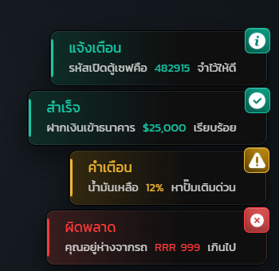

# Hyper_Notifyall

Hyper_Notifyall คือระบบแจ้งเตือนกลางของเซิร์ฟเวอร์ — สคริปต์อื่นเรียก export เส้นเดียวแล้วได้การ์ดแจ้งเตือน หลอดโหลด TextUI ประกาศกลางจอ และ HUD สถานะ ที่หน้าตาเหมือนกันทั้งเซิร์ฟ โดยไม่ต้องมี NUI ของตัวเอง

ปัจจุบันมี **85 resource** ในเซิร์ฟเวอร์เรียกใช้งานอยู่ ตั้งแต่ระบบกระเป๋า งานอาชีพ ร้านค้า ไปจนถึงอีเวนต์



## ข้อมูลทั่วไป

| หัวข้อ | ค่า |
| --- | --- |
| เวอร์ชัน | 1.1.0 |
| เฟรมเวิร์ก | ESX (`es_extended`) |
| ต้องมี | `es_extended`, `Hyper_Check` |
| หน้า NUI | `html/index.html` |
| Export ฝั่ง client | 23 รายการ |
| Export ฝั่ง server | 8 รายการ |
| ธีมสี | 7 ธีม สลับที่ `Config.Theme` |
| ชนิดการ์ดแจ้งเตือน | 10 ชนิด |
| ตำแหน่งวางการ์ด | 8 มุมจอ |
| ภาษา | ไทย (ฟอนต์ Kanit ฝังในตัว resource) |

## ทำอะไรได้บ้าง

| ระบบ | สรุป |
| --- | --- |
| การ์ดแจ้งเตือน | 10 ชนิด วางได้ 8 มุมจอ ไฮไลต์คำในข้อความได้ |
| ไอเทมเข้า–ออก | การ์ดไอเทมพร้อมสีความหายาก รวมหลายชิ้นเป็นใบเดียว |
| โทรศัพท์ | การ์ดสายเข้าแบบค้างจนกว่าจะรับ/วาง |
| ประกาศกลางจอ | 7 หัวข้อประกาศ + เมนูให้แอดมินพิมพ์เอง + ประกาศอัตโนมัติ 7 ข้อความ |
| รีสตาร์ท / ลบรถ | ตารางเวลาอัตโนมัติ + นับถอยหลัง + Discord webhook |
| เลขนำโชค | สุ่ม ID ผู้โชคดีทุกครั้งที่เซิร์ฟเปิด แล้วแจกรางวัล |
| TextUI | แบบติดหน้าจอ และแบบลอยตามพิกัดในโลก |
| หลอดโหลด | แบบแถบยาว และแบบเพชรจับเวลา วางได้ 9 ตำแหน่ง |
| HUD สถานะ | แถวเพชร buff/debuff พร้อมวงแหวนนับเวลา |
| การ์ดโปรไฟล์ | ดึงรูป Discord หรือ Steam ของผู้เล่นมาแสดง |

## เริ่มต้นเร็ว

ใส่ใน `server.cfg`

```
ensure Hyper_Notifyall
```

แล้วเรียกจากสคริปต์ไหนก็ได้

```lua
exports['Hyper_Notifyall']:sendNotify({
    text = {
        title = 'แจ้งเตือน',
        message = 'คุณอยู่ห่างจากรถ %s เกินไป',
        highlight = 'RRR 999',
    },
    type = 'error',
    time = 5 * 1000,
    layout = 'topRight',
})
```

## ไปต่อ

- [ฟีเจอร์หลัก](features.md) — ทุกระบบพร้อมค่าใน config ที่คุมมัน
- [การตั้งค่า](config.md) — ไฟล์ config ทั้ง 4 ไฟล์และค่าที่ปรับบ่อย
- [หน้าจอ UI](ui-screens.md) — ภาพจริงทั้ง 15 โหมด
- [ธีมสี](themes.md) — 7 ธีมพร้อมตารางสี
- [Export](export/README.md) — ตารางว่าจะทำอะไรต้องใช้ export ตัวไหน
