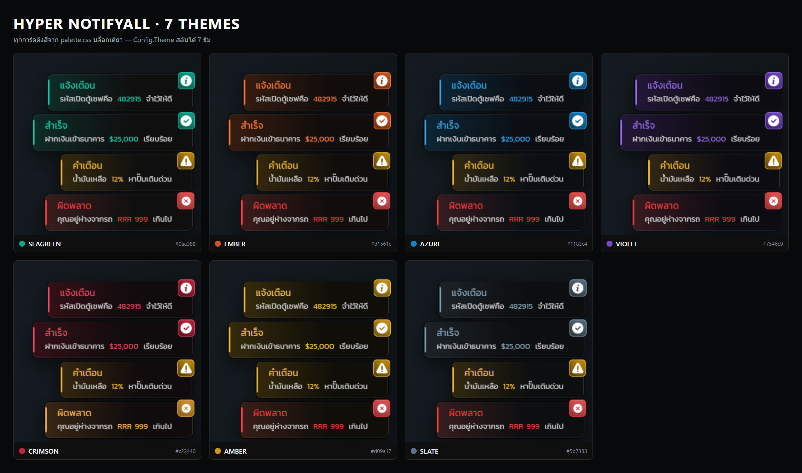
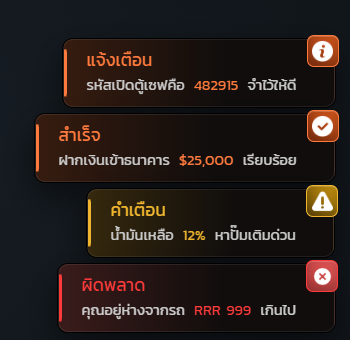
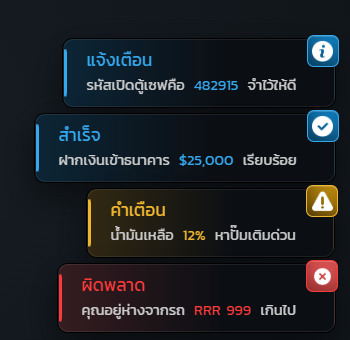
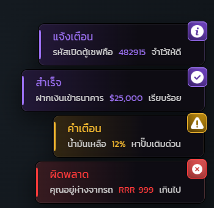
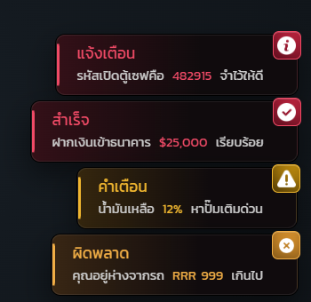
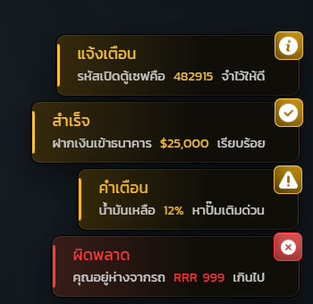
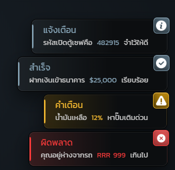

# ธีมสี

ทุกการ์ดในระบบอ่านสีจาก `html/css/palette.css` บล็อกเดียว การสลับธีมจึงเป็นแค่การเปลี่ยนค่าเจ็ดตัวบนสุด ไม่มีจุดไหนใน stylesheet ฝังสีแบรนด์ไว้ตรง ๆ

```lua
-- config/config.general.lua
Config.Theme = 'seagreen'
```



## ตารางสี

| ธีม | สีหลัก | ไฮไลต์ | สว่าง | พื้นแผง | สี error |
| --- | --- | --- | --- | --- | --- |
| seagreen (ค่าเริ่มต้น) | `#07705f` | `#0aa388` | `#16c7a6` | `#0f0f0f` | `#e25656` |
| ember | `#8f3410` | `#d1561c` | `#ff7a3d` | `#100d0c` | `#e25656` |
| azure | `#0a4f7a` | `#1183c4` | `#35a8ee` | `#0b0e13` | `#e25656` |
| violet | `#4a2a86` | `#7546c9` | `#9a6ff0` | `#0e0c13` | `#e25656` |
| crimson | `#7a1226` | `#c22440` | `#f04a66` | `#100b0d` | `#d9922e` |
| amber | `#8a6410` | `#d09a17` | `#f5bf3d` | `#0f0e09` | `#e25656` |
| slate | `#35434c` | `#5b7383` | `#83a0b2` | `#0c0e10` | `#e25656` |


ธีม crimson เปลี่ยนสี error เป็นเหลืองอำพันโดยตั้งใจ เพราะสีธีมเองเป็นแดงอยู่แล้ว ถ้าปล่อยให้ error เป็นแดงด้วย การ์ดเตือนจะกลืนไปกับการ์ดธรรมดา


## ธีมเปลี่ยนอะไรบ้าง

| เปลี่ยนตามธีม | คงที่ทุกธีม |
| --- | --- |
| การ์ด `info` `success` `message` | การ์ด `warning` (เหลือง) |
| ป้าย TextUI ทั้งสองแบบ | การ์ด `error` (แดง — ยกเว้น crimson) |
| หลอดโหลดและวงแหวนเพชร | การ์ด `police` `medic` `council` `alert` ซึ่งมีสีประจำหน่วยงาน |
| เมนูประกาศและปุ่มหัวข้อที่เลือกอยู่ | สีความหายากของไอเทม ซึ่งมาจากระบบกระเป๋า |
| การ์ดโปรไฟล์และกรอบมุม | |
| พื้นแผงและเงาทุกใบ | |

## ทีละธีม

### seagreen


ค่าเริ่มต้นของเซิร์ฟเวอร์ เขียวอมฟ้า

### ember



ส้มอุ่น

### azure



ฟ้าเย็น

### violet



ม่วง

### crimson



แดง — สังเกตว่าการ์ด error กลายเป็นเหลืองอำพันเพื่อไม่ให้ชนกับสีธีม

### amber



ทอง

### slate



เทาอมฟ้า ไม่มีสีเด่น เหมาะกับเซิร์ฟที่อยากให้ UI เงียบ ๆ

## เพิ่มธีมเอง

เพิ่มบล็อกใหม่ท้าย `html/css/palette.css` แล้วใส่ชื่อนั้นใน `Config.Theme`

```css
[data-theme="mytheme"] {
    --c-primary: #123456;
    --c-accent: #2a7fb8;
    --c-accent-hi: #4aa3dd;
    --c-accent-soft: #9fd0ee;
    --c-accent-top: #6fbbe8;
    --c-surface: #0b0d10;
    --c-danger: #e25656;
    --c-accent-rgb: 42 127 184;
    --c-surface-rgb: 11 13 16;
    --c-shell-rgb: 7 9 11;
    --accent-deep: #0d2c42;
    --accent-deeper: #091d2d;
}
```

ชื่อธีมที่ระบบไม่รู้จักจะตกกลับไปใช้ seagreen เอง
