# หน้าจอ UI

ภาพทั้งหมดถ่ายจากโค้ด NUI จริงของ resource บนจอ 1920×1080 ธีม seagreen ข้อมูลในภาพเป็นข้อมูลจำลองสำหรับสาธิต

## 1. การ์ดแจ้งเตือนพื้นฐาน

สี่ชนิดที่ใช้บ่อยที่สุด แต่ละใบมีแถบสีด้านซ้าย ไอคอนวงกลมมุมขวาบน และคำที่ไฮไลต์ไว้ในข้อความถูกย้อมสีตามชนิดการ์ด ภาพนี้วางที่ `topRight`

## 2. การ์ดแจ้งเตือนตามหน่วยงาน

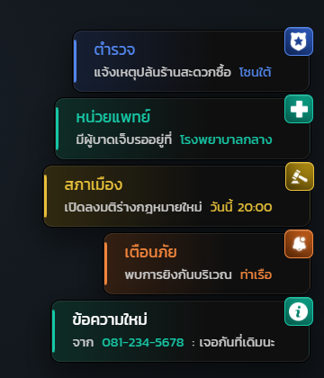

อีกห้าชนิดสำหรับงานเฉพาะทาง — ตำรวจเป็นน้ำเงิน หน่วยแพทย์เป็นเขียว สภาเมืองเป็นทอง เตือนภัยเป็นส้ม และข้อความโทรศัพท์ใช้โทนเดียวกับ `info`

## 3. สายโทรเข้า

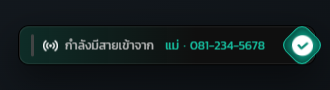

การ์ดสายเข้าวางกลางขอบขวา ส่ง `hold = true` ไว้จึงค้างอยู่จนกว่าสคริปต์โทรศัพท์จะสั่งปิดตอนรับสายหรือวางสาย

## 4. ได้รับไอเทม

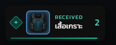

ไอเทมชิ้นแรกของรอบขึ้นเป็นการ์ดเดี่ยว เพชรด้านซ้ายบอกทิศทาง (เข้า/ออก) กรอบรูปย้อมสีตามระดับความหายาก และแถบเวลาที่ก้นการ์ดเดินถอยหลัง

## 5. ได้รับหลายชิ้นพร้อมกัน

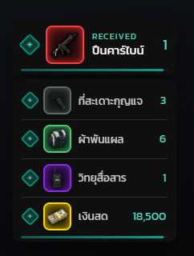

เมื่อได้ของหลายชิ้นในจังหวะเดียว ชิ้นแรกยังเป็นการ์ดเดี่ยวด้านบน ที่เหลือไหลรวมในการ์ดลิสต์ใบเดียวด้านล่าง สีกรอบแต่ละแถวบอกระดับความหายาก ไล่จากแดง (มิธิค) ทอง (ตำนาน) ม่วง (เอพิค) เขียว (ไม่ธรรมดา) จนถึงเทา (ทั่วไป)

## 6. ไอเทมออกจากตัว

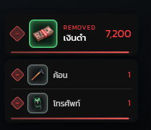

ของที่หายไปใช้โครงเดียวกันแต่เปลี่ยนเป็นโทนแดง หัวข้อเป็น REMOVED เพชรเป็นเครื่องหมายลบ และแถบเวลาเป็นสีแดง

## 7. ประกาศกลางจอ

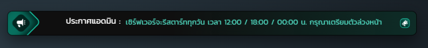

แถบประกาศพาดด้านบนกลางจอ โลโก้ซ้ายและไอคอนขวาตั้งแยกได้ตามหัวข้อประกาศ ภาพนี้คือหัวข้อ Admin

## 8. เมนูประกาศของแอดมิน

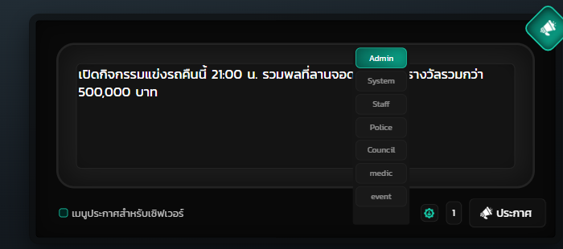

เปิดด้วยคำสั่ง `openMenuAnm` เฉพาะกลุ่ม `admin` พิมพ์ข้อความในกล่องกลาง กดไอคอนเฟืองเพื่อกางรายชื่อหัวข้อทั้ง 7 (Admin กำลังถูกเลือกอยู่) ตั้งจำนวนครั้งที่ช่องตัวเลข แล้วกดปุ่มประกาศ กด ESC เพื่อปิด

## 9. นับถอยหลังรีสตาร์ท

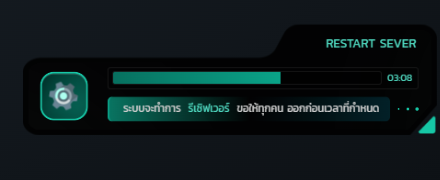

การ์ดวางกลางขอบขวา หลอดด้านบนไหลลงตามเวลาที่เหลือพร้อมตัวเลขนาที:วินาที ข้อความด้านล่างไฮไลต์คำว่ารีเซิฟเวอร์ไว้ ตัวจับเวลาอยู่ฝั่งเซิร์ฟเวอร์ ผู้เล่นที่เข้ามากลางทางจะเห็นเวลาที่เหลือจริง

## 10. นับถอยหลังลบรถ

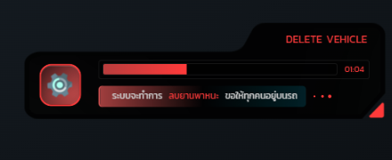

โครงเดียวกับการ์ดรีสตาร์ทแต่เป็นโทนแดง เตือนให้ผู้เล่นขึ้นไปอยู่บนรถเพราะรถที่ไม่มีคนนั่งจะถูกลบทั้งหมด

## 11. ป้ายปุ่มกดและหลอดโหลด

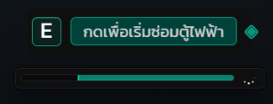

ป้ายปุ่มกดอยู่บน หลอดโหลดอยู่ล่าง ทั้งคู่วางที่ `bottomCenter` หลอดนี้เปิด `canCancel` ไว้จึงกดยกเลิกระหว่างทางได้

## 12. หลอดเพชรจับเวลา

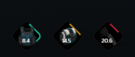

หลอดแบบเพชรซ้อนกันได้หลายอันพร้อมกัน แต่ละอันมีไอคอน วงแหวนสีที่กินตามเวลาที่เหลือ และตัวเลขวินาที วางได้ 9 ตำแหน่งบนจอ และมี callback ให้สคริปต์เจ้าของทำงานต่อเมื่อครบเวลา

## 13. ป้าย TextUI ลอยในโลก

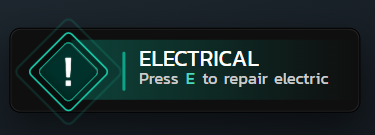

ป้ายที่ลอยอยู่กับพิกัดในโลก ขึ้นเองเมื่อผู้เล่นเดินเข้าใกล้ หัวข้ออยู่บรรทัดบน คำแนะนำอยู่บรรทัดล่างพร้อมปุ่มที่ไฮไลต์ไว้ ไอคอนและสีเปลี่ยนตามชนิดป้ายที่ตั้งใน config

## 14. การ์ดโปรไฟล์

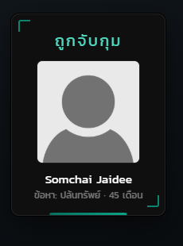

การ์ดมุมขวาล่างพร้อมรูปโปรไฟล์ของผู้เล่นที่ดึงจาก Discord หรือ Steam หัวข้ออยู่บน ชื่อและรายละเอียดอยู่ล่าง การ์ดหลายใบจะต่อคิวแสดงทีละใบ


ป้ายบอกทาง blip บนแผนที่ และอนิเมชันตัวละคร เป็นของเอนจินเกมโดยตรง ไม่ได้วาดด้วย NUI จึงถ่ายนอกเกมไม่ได้ ต้องแคปในเกมเอาเอง

